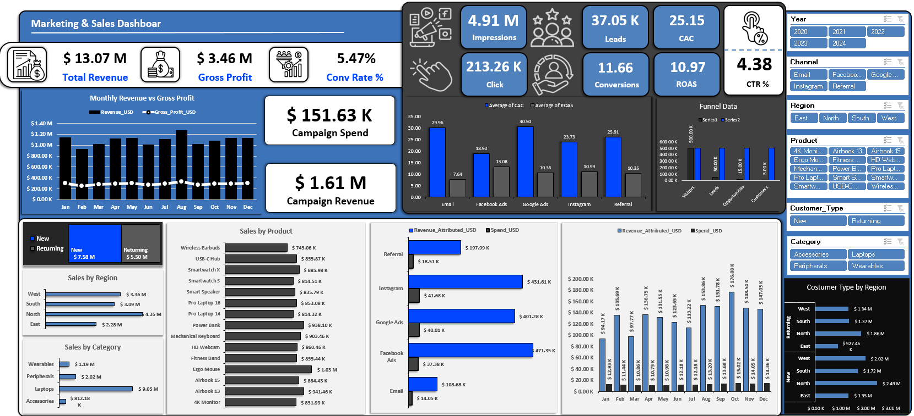
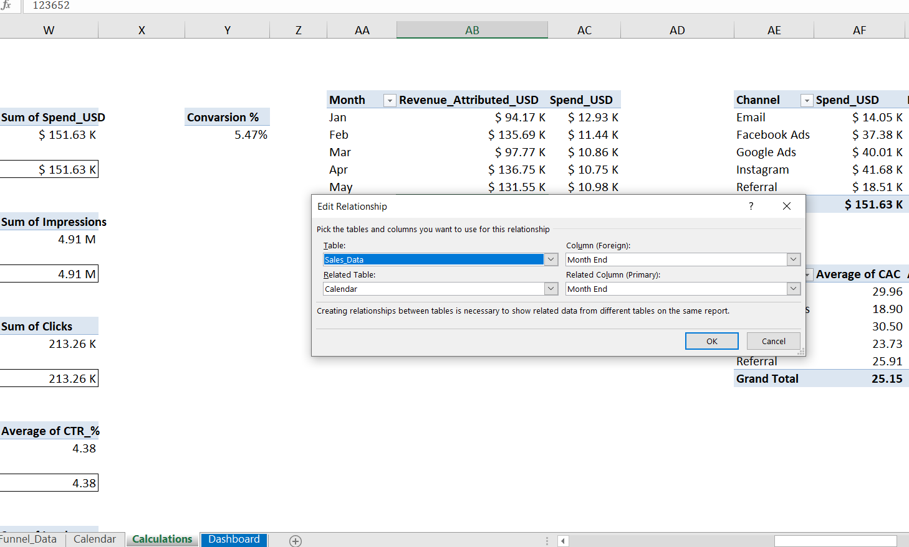
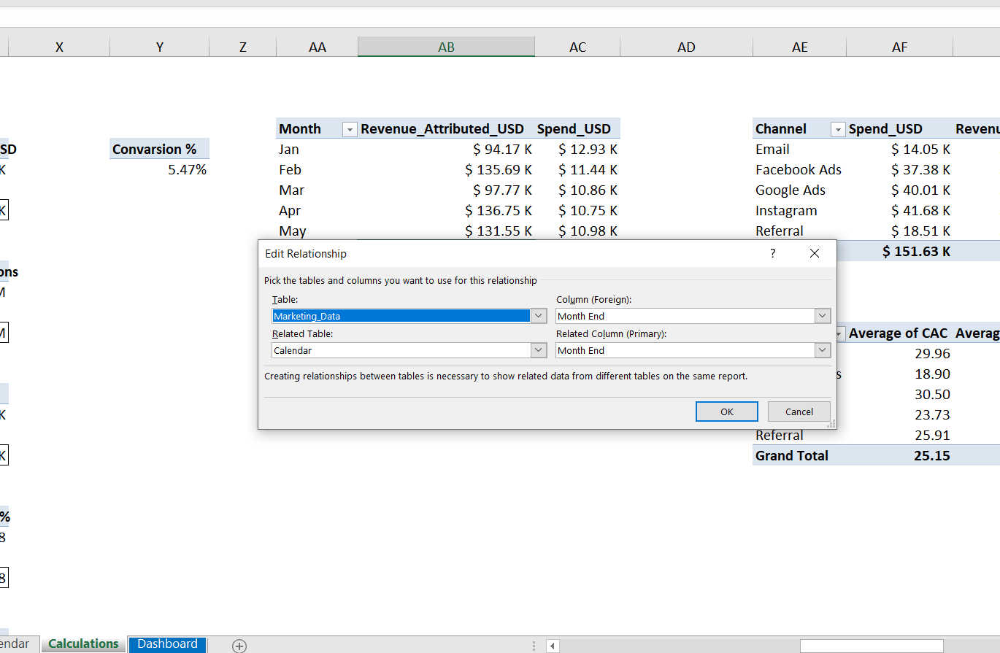
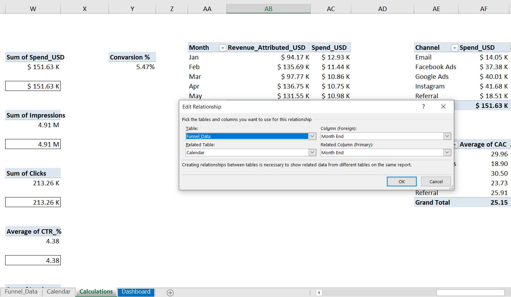

# 📊 Marketing & Sales Dashboard — Excel

> A fully interactive Excel dashboard combining Sales performance, Marketing analytics, and Funnel tracking — built with Power Pivot, Data Modeling, and dynamic slicers.

---

## 🖼️ Dashboard Preview



---

## 🗃️ Data Model — Table Relationships

The workbook uses a **star schema** built with Excel's Power Pivot Data Model. Three fact tables are connected to a central **Calendar** dimension table via `Month End`, enabling synchronized cross-filtering across all visuals.

| | |
|---|---|
|  |  |
| `Sales_Data` linked to `Calendar` via **Month End** | `Marketing_Data` linked to `Calendar` via **Month End** |
|  | |
| `Funnel_Data` linked to `Calendar` via **Month End** | |

### Schema Overview

```
                    ┌─────────────┐
                    │  Calendar   │  ← Dimension Table (Primary)
                    │  Month End  │
                    └──────┬──────┘
           ┌───────────────┼───────────────┐
           ▼               ▼               ▼
    ┌─────────────┐ ┌─────────────┐ ┌─────────────┐
    │ Sales_Data  │ │Marketing_   │ │ Funnel_Data │
    │  Month End  │ │    Data     │ │  Month End  │
    └─────────────┘ │  Month End  │ └─────────────┘
                    └─────────────┘
```

---

## 📌 KPIs & Metrics

### 💰 Sales
| Metric | Value |
|--------|-------|
| Total Revenue | $13.07 M |
| Gross Profit | $3.46 M |
| Conversion Rate | 5.47% |

### 📣 Marketing
| Metric | Value |
|--------|-------|
| Impressions | 4.91 M |
| Clicks | 213.26 K |
| Leads | 37.05 K |
| Conversions | 11.66 |
| CAC | 25.15 |
| ROAS | 10.97 |
| CTR % | 4.38 |
| Campaign Spend | $151.63 K |
| Campaign Revenue | $1.61 M |

---

## 📈 Visuals Included

- **Monthly Revenue vs Gross Profit** — line & bar combo
- **Sales by Region** — East, West, North, South
- **Sales by Category** — Accessories, Laptops, Peripherals, Wearables
- **Sales by Product** — 15+ products ranked by revenue
- **CAC & ROAS by Channel** — Email, Facebook Ads, Google Ads, Instagram, Referral
- **Revenue vs Spend by Channel** — monthly trend
- **Funnel Data** — Visitors → Leads → Opportunities → Customers
- **Customer Type by Region** — New vs Returning, split by geography

---

## 🔧 Technical Implementation

### Sheets Structure
```
📗 Workbook
├── 📄 Funnel_Data     ← Funnel metrics fact table
├── 📄 Calendar        ← Date dimension table
├── 📄 Calculations    ← Intermediate pivot measures
└── 📄 Dashboard       ← Final interactive dashboard
```

### Tools & Techniques
- **Power Pivot** — in-memory data model with table relationships
- **Star Schema** — Calendar as central dimension, 3 fact tables
- **Pivot Tables** — cross-table aggregations via data model
- **Dynamic Slicers** — Year, Channel, Region, Product, Customer Type, Category
- **KPI Cards** — custom formatted cells with icons
- **Advanced Charts** — clustered bars, combo charts, funnel

---

## 📥 How to Use

1. Download `Marketing_Sales_Dashboards.xlsx`
2. Open with **Microsoft Excel 2016+** (Power Pivot required)
3. Navigate to the **Dashboard** sheet
4. Use the **slicers on the right panel** to filter:
   - Year (2020–2024)
   - Channel (Email, Facebook, Google Ads, Instagram, Referral)
   - Region (East, North, South, West)
   - Product, Customer Type, Category
5. All KPIs and charts update dynamically

---

## 📥 Download Excel File 

To have access to all the options this task has (slicer, formulas, pivot-table ...), please download the Excel file locally and you can use all the options listed above.

[**Download**](https://github.com/ermirhaxhia/marketing-sales-dashboard/raw/main/Marketing%20Sales%20Dashboards.xlsx)

## 👤 Author

**Ermir Haxhia** — Applied Mathematics · Data Analysis · Programming  
🌐 [Portfolio](https://ermir-haxhia.vercel.app) · [LinkedIn](https://www.linkedin.com/in/ermir-haxhia-b988212b5) · [GitHub](https://github.com/ermirhaxhia)